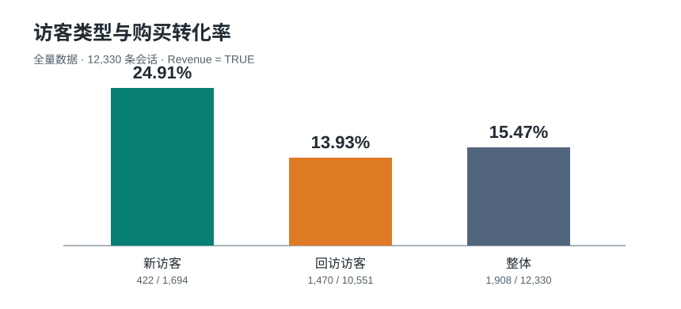

# 在线购物会话转化分析 | SQL 与 R

用 SQLite 分析 UCI Online Shoppers Purchasing Intention 数据集，并对照 STAT 301 的 [R final report](https://github.com/zja42/stat301-project/blob/prediction/stat301_code.ipynb) 检查预测模型。SQL 描述全量 **12,330 条会话**；R 报告先排除 `Region == 1`，再用 **7,550 条会话**建模。下文分别标注口径。

## SQL 分析结果（全量数据）

`Revenue = TRUE` 表示该会话发生购买；转化率 = 成交会话数 / 会话数。所有数字由 [02_analysis.sql](02_analysis.sql) 中的查询计算，属于描述性观察，不能直接解释为促销或页面行为造成的增量效果。

| 观察角度 | 会话数 / 成交数 | 转化率 | 解读 |
|---|---:|---:|---|
| 全部会话 | 12,330 / 1,908 | **15.47%** | 不购买会话占多数 |
| 11 月 | 2,998 / 760 | **25.35%** | 数据集中转化率最高的月份；仅凭月份不能证明黑五的因果作用 |
| 新访客 `New_Visitor` | 1,694 / 422 | **24.91%** | 单次会话转化率较高 |
| 回访访客 `Returning_Visitor` | 10,551 / 1,470 | **13.93%** | 因会话量大，贡献了更多成交会话 |
| 其他访客 `Other` | 85 / 16 | **18.82%** | 样本较小，应单独列出 |
| 周末 | 2,868 / 499 | **17.40%** | 高于工作日的 14.89%；这只是相关性 |



新访客的会话转化率是回访访客的约 **1.79 倍**，比回访访客高 **10.98 个百分点**。`Returning_Visitor` 是会话分类，并不等于“已经购买过的老客户”；该数据无法单独证明老客召回优于拉新。投入选择还需要渠道成本、客户价值和增量实验。

其他可复核的分组结果：

- 流量来源：在会话数至少 50 的渠道中，`TrafficType = 8` 为 **27.70%**（95/343），`TrafficType = 13` 为 **5.83%**（43/738）。渠道编号没有业务名称，不能据此直接指定投放渠道。
- 页面价值：`PageValues = 0` 的转化率为 **3.85%**（370/9,600），`PageValues >= 50` 为 **81.13%**（331/408）。这是很强的预测信号，但必须确认页面价值在实际预测时是否已经可用。
- 特殊日：`SpecialDay = 0` 的转化率为 **16.53%**（1,831/11,079）；最高一档（`SpecialDay >= 0.8`）为 **4.38%**（21/479）。本数据不支持“越接近促销日转化越高”的原结论，也不能将 `SpecialDay = 0` 简单解释为“无促销”。

## 对照 R Final Report（筛选后数据）

[STAT 301 final report](https://github.com/zja42/stat301-project/blob/prediction/stat301_code.ipynb) 由 Sarah Chan、Zewen Jin、Bryan Sun 和 Lucas Ortiz Molina 完成。它使用 `Region != 1` 的 **7,550 条会话**、按 `Revenue` 分层的 **70/30 训练/测试切分**。以下是报告中实际执行的检查与结果，不是用本仓库的 SQL 全量数据重新训练出的分数。

| 报告中的检查 / 测试 | 方法与结果 | 如何理解 |
|---|---|---|
| 数据与类别检查 | 检查字段类型、缺失值和购买比例；购买约占 **15.1%** | 类别不平衡，单看准确率容易误判 |
| 共线性诊断 | 先检查相关变量；普通逻辑回归中因别名问题移除 `Browser`，再用 VIF 检查，报告保留变量的 VIF 均小于 5 | 属于建模诊断，不是转化率显著性检验 |
| 10 折交叉验证 | LASSO 的最佳 AUC **0.9114**（标准误 0.00683，`lambda = 0.0404`）；Ridge 为 **0.8930**（标准误 0.005951，`lambda = 0.0179`） | 在训练数据上选择正则化模型与参数 |
| 训练集模型比较 | 以 **0.30** 为分类阈值：LASSO 召回率 **0.392**、平衡准确率 **0.685**；Ridge **0.517 / 0.739**；普通逻辑回归 **0.561 / 0.758** | LASSO 按 AUC 选中，但在此阈值下漏掉较多购买会话 |
| 最终模型特征 | LASSO 保留 `ExitRates`、`PageValues`、`MonthNov` | 是该模型选出的预测变量，不代表因果效应 |
| 留出测试集 | LASSO ROC-AUC **0.909**；在阈值 0.30 下，TP **129**、FN **213**、FP **43**、TN **1,881**；召回率 **0.377**、精确率 **0.750**、平衡准确率 **0.677**、准确率 **0.887** | ROC-AUC 较高，但当前阈值仍漏掉约 62.3% 的购买会话 |

R 报告的 `PageValues` 结果与 SQL 的分组差异方向一致。不过两者使用不同样本、不同方法，不能称为独立实验验证，也不能把这些模型指标与上方全量 SQL 转化率直接作同口径比较。报告中的交叉验证、VIF、混淆矩阵和 ROC-AUC 是模型检查与性能评估；这里没有声称访客类型或特殊日差异通过了显著性检验。

仓库里的 [03_model.R](03_model.R) 是另一个使用全量数据的辅助分析脚本，输出访客分组、普通逻辑回归和 10 折准确率。本次运行得到平均准确率 **0.8848**（标准差 **0.0053**）；它的模型与上述 final report 的筛选样本、LASSO 和 AUC 测试不同，也不能仅凭准确率判断购买类识别效果。

## 复现 SQL

本仓库提供建表和分析 SQL；原始 CSV 存放在 [STAT 301 数据目录](https://github.com/zja42/stat301-project/blob/prediction/data/online_shoppers_intention.csv)。在本仓库目录运行：

```bash
curl -L https://raw.githubusercontent.com/zja42/stat301-project/prediction/data/online_shoppers_intention.csv -o online_shoppers_intention.csv
sqlite3 shop.db < 01_setup.sql
python3 -m venv .venv
.venv/bin/python -m pip install pandas
.venv/bin/python - <<'PY'
import sqlite3
import pandas as pd

df = pd.read_csv('online_shoppers_intention.csv')
df.insert(0, 'id', range(1, len(df) + 1))
with sqlite3.connect('shop.db') as con:
    df.to_sql('online_shoppers', con, if_exists='append', index=False)
PY
sqlite3 -header -column shop.db < 02_analysis.sql
```

`01_setup.sql` 只负责建表，CSV 不随本仓库重复存储。R 模型的完整代码、输出和图表在上述 final report 中。

## 仓库文件

- [01_setup.sql](01_setup.sql)：SQLite 表结构与导入说明
- [02_analysis.sql](02_analysis.sql)：整体、月份、访客、渠道、页面价值、特殊日与周末查询
- [03_model.R](03_model.R)：全量数据的辅助 R 分析
- [key_findings.svg](key_findings.svg)：按 SQL 数值修正的访客转化率图
- [LICENSE](LICENSE)：MIT 许可

数据来源：[UCI Online Shoppers Purchasing Intention Dataset](https://archive.ics.uci.edu/dataset/468/online+shoppers+purchasing+intention+dataset)。分析单位是会话，不能将会话数直接当成独立客户数。
